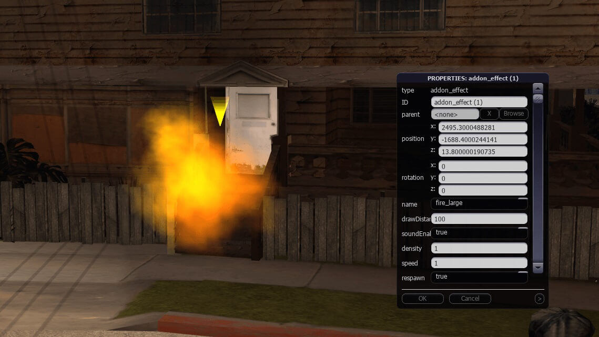

# Effects Add-on for MTA:SA Map Editor

You want to add effects inside the MTA:SA Map Editor? You've come to the right place.

## Installation

1. Download the latest release
2. Put the resource inside your `MTA San Andreas 1.5/server/mods/deathmatch/resources` folder
3. Refresh resources by running `refreshall` in your server console
4. The add-on is ready for use!

## How to use in map editor

1. Start the map editor resource (`editor`) or enter the Map Editor from the main menu
2. Click "definitions" from the top editor menu
3. Add "editor_addon_effects" to your definitions and press OK
4. Hover on the buttons in the bottom-left corner, and scroll your mouse wheel once
5. Click the "Effect" button to place a new effect into the game world
6. Double-click the effect to change its properties, such as type, draw distance, sound, density, speed and respawn
7. Once you've finished with your map, save the map in a resource

## How to use with a saved map

Start your map resource **together** with this `editor_addon_effects` resource, and you should be able to see the effects placed in the game world using your defined settings!

## License

MIT License

Copyright (c) 2021 patrikjuvonen

Permission is hereby granted, free of charge, to any person obtaining a copy
of this software and associated documentation files (the "Software"), to deal
in the Software without restriction, including without limitation the rights
to use, copy, modify, merge, publish, distribute, sublicense, and/or sell
copies of the Software, and to permit persons to whom the Software is
furnished to do so, subject to the following conditions:

The above copyright notice and this permission notice shall be included in all
copies or substantial portions of the Software.

THE SOFTWARE IS PROVIDED "AS IS", WITHOUT WARRANTY OF ANY KIND, EXPRESS OR
IMPLIED, INCLUDING BUT NOT LIMITED TO THE WARRANTIES OF MERCHANTABILITY,
FITNESS FOR A PARTICULAR PURPOSE AND NONINFRINGEMENT. IN NO EVENT SHALL THE
AUTHORS OR COPYRIGHT HOLDERS BE LIABLE FOR ANY CLAIM, DAMAGES OR OTHER
LIABILITY, WHETHER IN AN ACTION OF CONTRACT, TORT OR OTHERWISE, ARISING FROM,
OUT OF OR IN CONNECTION WITH THE SOFTWARE OR THE USE OR OTHER DEALINGS IN THE
SOFTWARE.
